# Evidencias · RA2 SBD (rellenar por el alumnado)

> Completa este documento con capturas/salidas. No incluyas secretos.
> Indica si has usado **Variante A (IAM Role)** o **Variante B (aws configure)**.

## 0) Identificación
- Alumno/a:
- Grupo:
- Variante usada (A/B):
- Región AWS:
- Bucket S3:

---

## 1) S3 privado
- [ ] Captura del bucket (nombre y región)
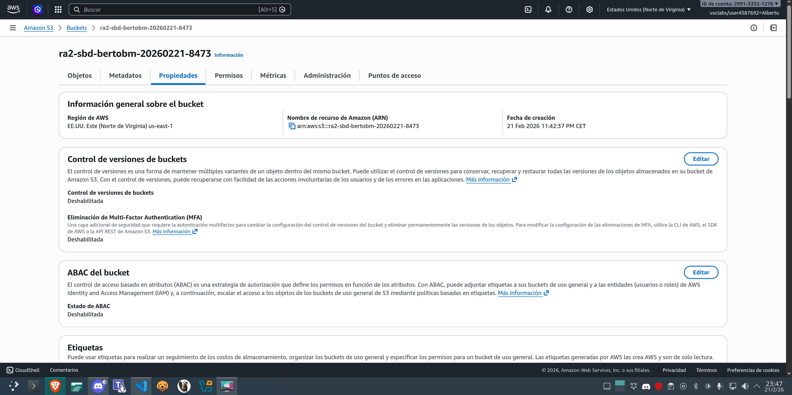
- [ ] Captura/confirmación de que **no es público** (Block Public Access o permisos)
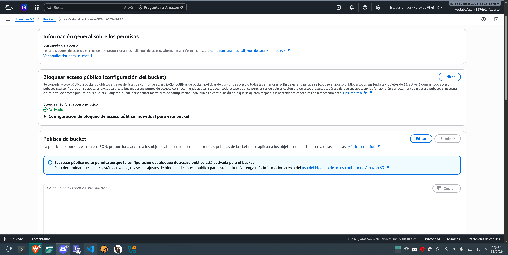
- [ ] Captura del objeto JSON en `data/sensores/`
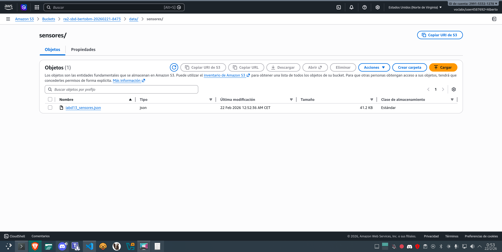

**Notas:**
- Key usada (S3_KEY):

---

## 2) Notebook / Script de subida
- [ ] Captura de la ejecución del notebook/script subiendo a S3
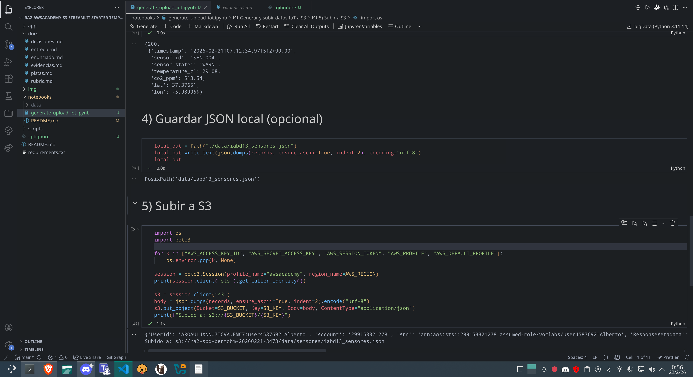
- [ ] Enlace o ruta del archivo en el repo (`notebooks/...`)
Ruta en el repositorio:
    `notebooks/generate_upload_iot.ipynb`

Enlace directo en GitHub:
    https://github.com/AlbertoBrMa/ra2-awsacademy-s3-streamlit-starter-template/blob/main/notebooks/generate_upload_iot.ipynb
---

## 3) EC2 y red
- [ ] Captura de la instancia EC2 (Ubuntu 22.04)
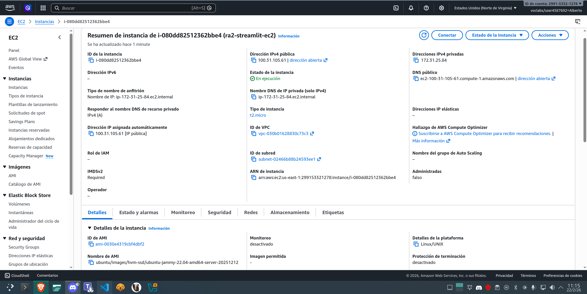
- [ ] Captura del Security Group con puerto 8501 abierto (según reglas del lab)
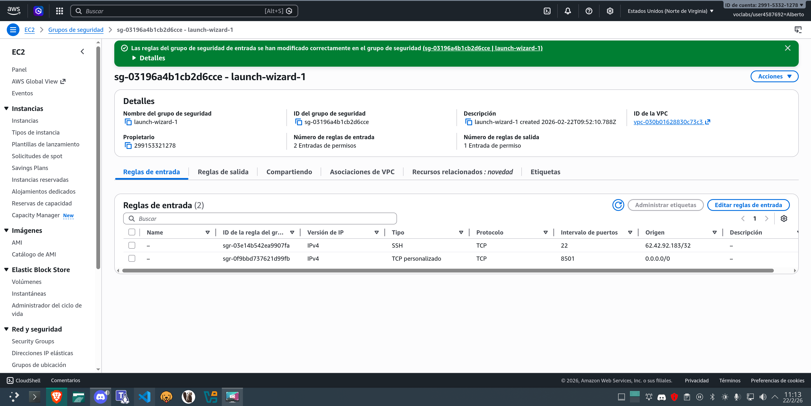
- [ ] Salida de `ssh` conectando (sin mostrar claves)
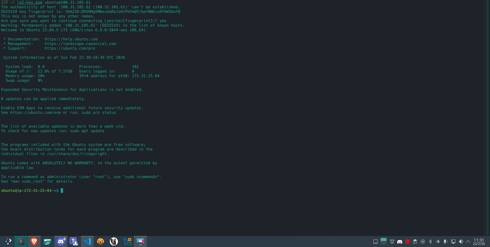

---

## 4) Acceso a S3 desde EC2 (sin secretos)
Ejecuta en EC2:

```bash
aws sts get-caller-identity
aws s3 ls s3://<BUCKET>/data/sensores/
```

- [ ] Captura/salida de ambos comandos
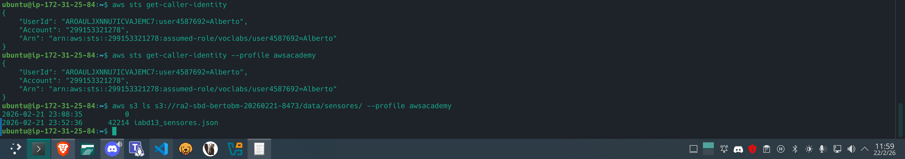

---

## 5) Streamlit en EC2
- [ ] Captura de `streamlit hello` funcionando (o `python -c "import streamlit"`)
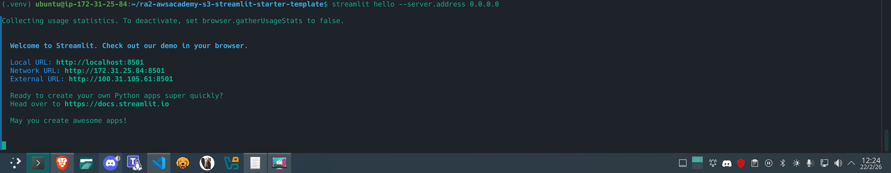
- [ ] Captura de instalación de dependencias (`pip install -r requirements.txt`)
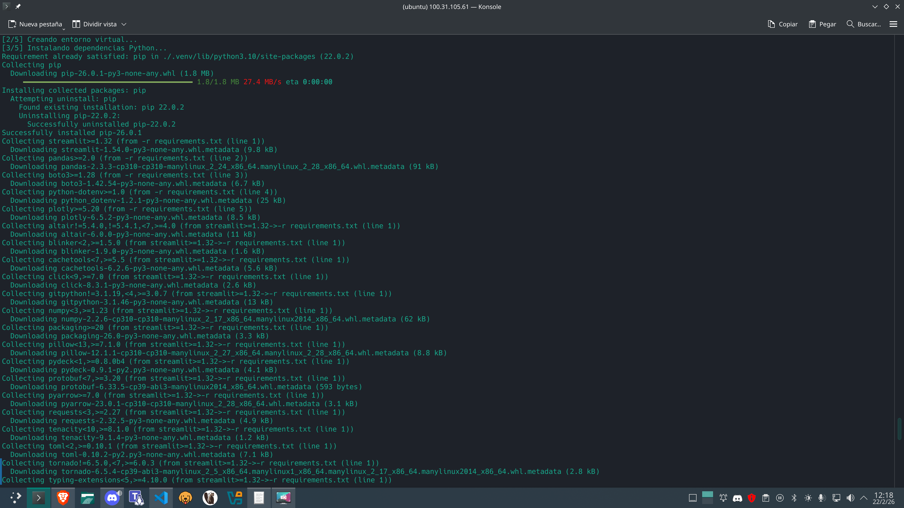

---

## 6) Dashboard (funcionalidad)
Incluye capturas donde se vea:

- [ ] Filtro por `sensor_state`
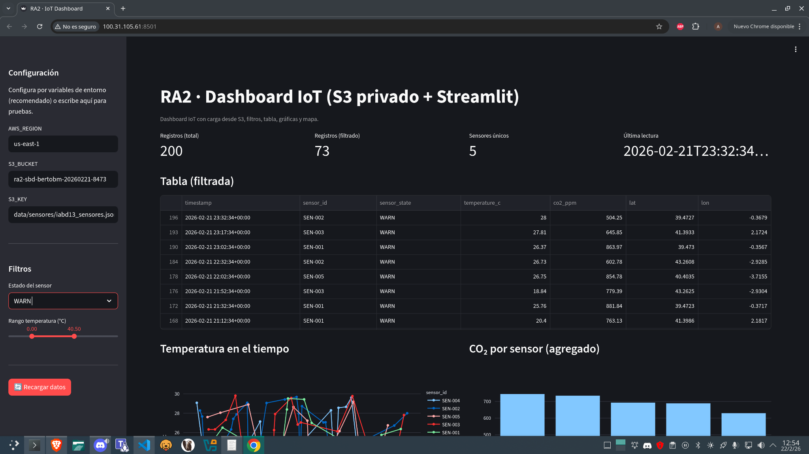
- [ ] Slider de temperatura
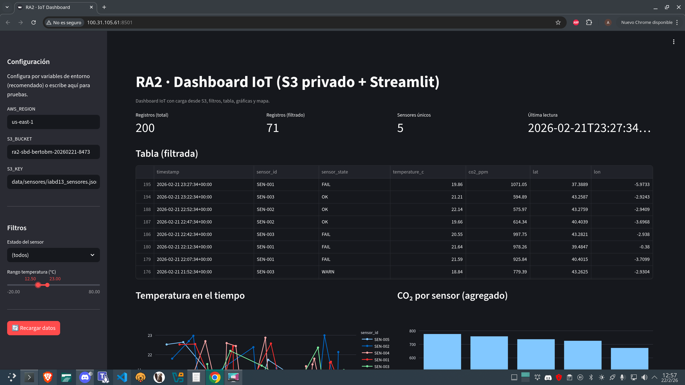
- [ ] Tabla filtrada
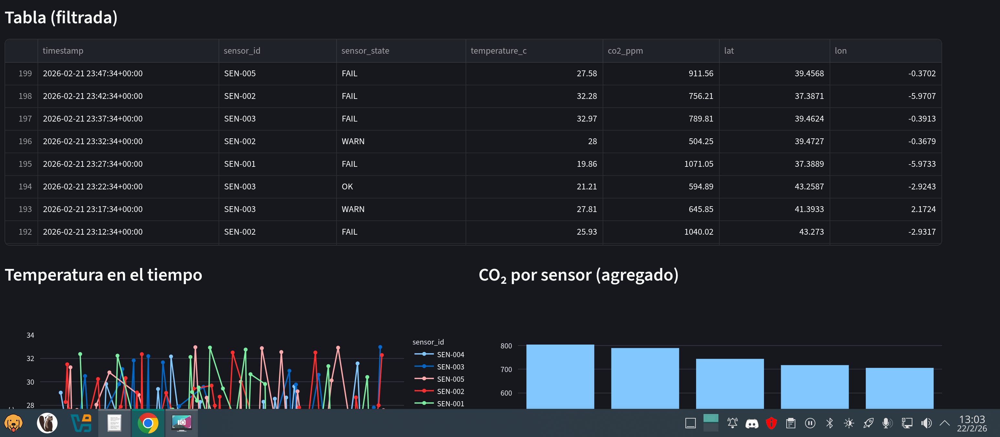
- [ ] Gráfica línea (temperatura vs tiempo)
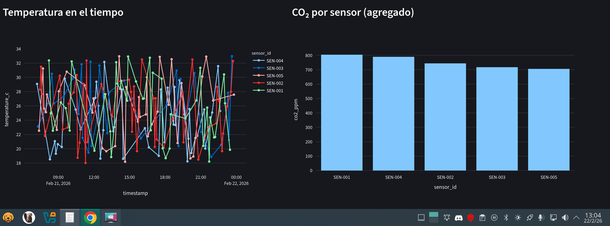
- [ ] Gráfica barras (CO₂ por sensor)
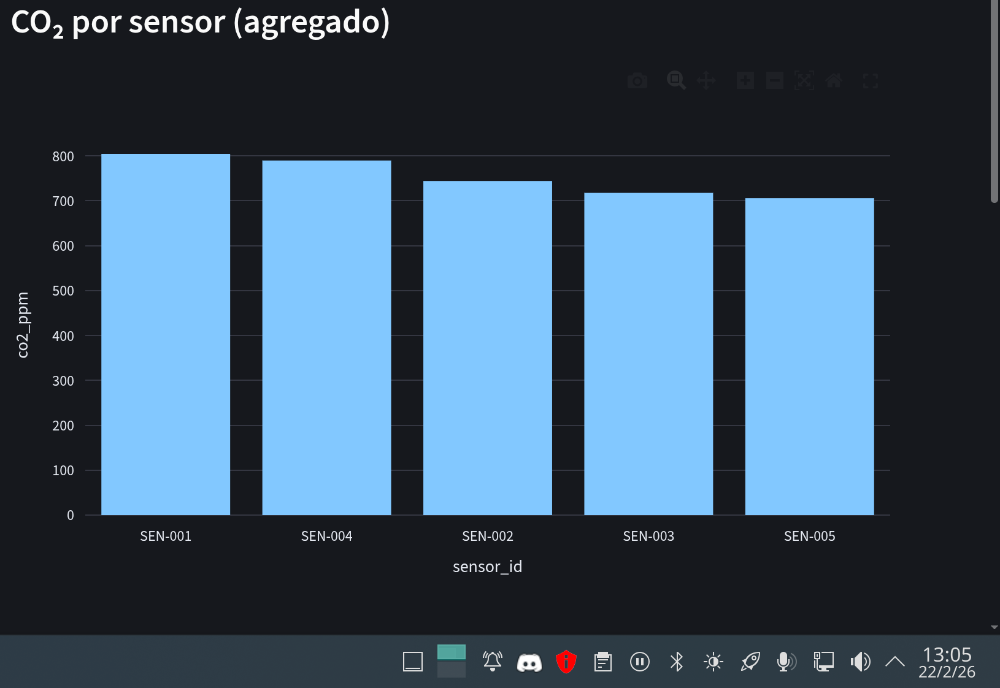
- [ ] Mapa con sensores
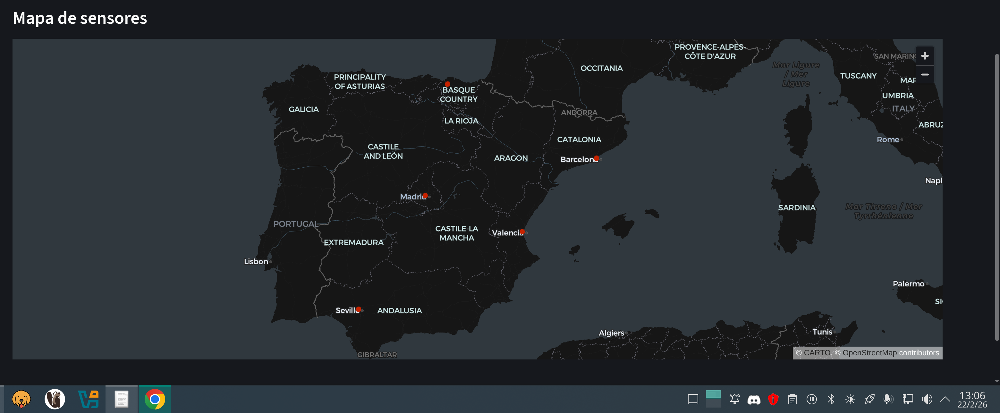

---

## 7) Despliegue final
- [ ] Comando usado para arrancar en segundo plano (ej. `nohup` o script)
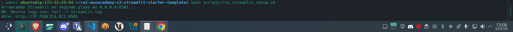
- [ ] Captura del log (`tail -n 50 streamlit.log` o similar)
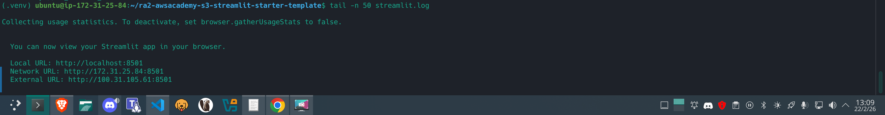
- [ ] URL final:

**URL:** `URL: http://100.31.105.61:8501`

- [ ] Captura en navegador accediendo a la URL
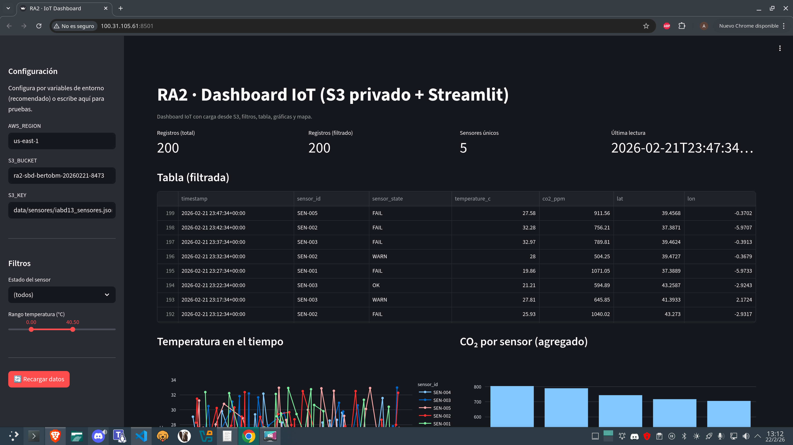

---

## 8) Observaciones (opcional)
- Problemas encontrados y solución:
  Al arrancar en EC2 con `streamlit run app/dashboard.py`, la aplicación fallaba con `ModuleNotFoundError: No module named 'app'`. El problema era que, en esa ejecución, Python no resolvía el paquete raíz `app` en los imports absolutos (`from app.services...`). Se corrigió adaptando los imports en `app/dashboard.py` para soportar ambos contextos: primero intenta `from app.services...` y, si falla, usa `from services...`.
